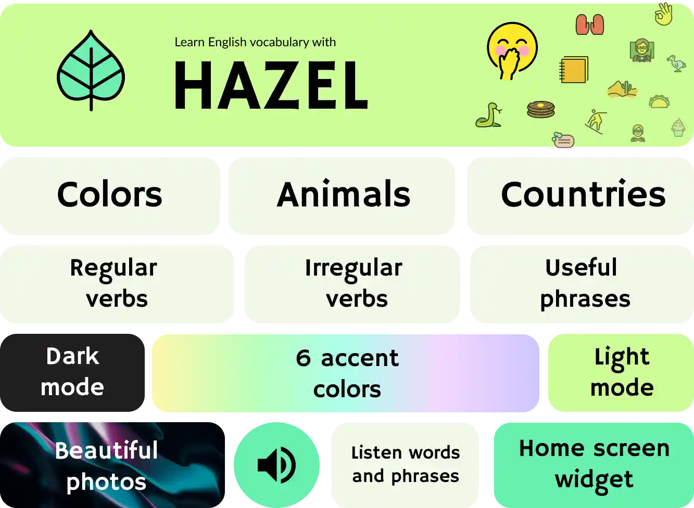

# Hazel - Learn English vocabulary

Learn a variety of English vocabulary by using the most beautiful and colorful visual dictionary app to learn verbs, colors, countries and nationalities, and much more.

# About the project
The project was born for a hackathon called AristiComp 2021 and also I used the project for participating in the HUAWEI Developers LATAM: Winter Contest 2021, in consequence, I implemented some kits from the Huawei Mobile Services on Hazel. Now you can Download Hazel on Huawei's AppGallery. And finally, in April 2022 it arrives on Google Play.
